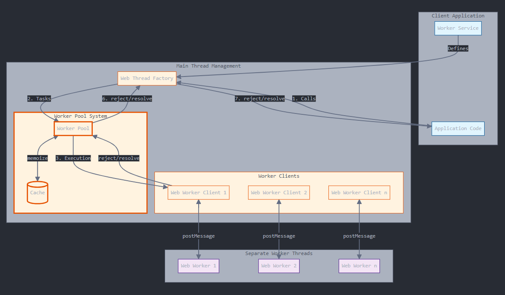

# <!--fit--> Web Workers 🚀

## Come gestire operazioni intensive in Javascript

**Emanuele Pancisi**
*Software Engineer in myDev*

*11 Dicembre 2024*

🔗 [github.com/panchhh/webworkers](https://github.com/panchhh/webworkers)

---

# Di cosa parleremo oggi 🎯

<div class="important">

### Problema e funzionamento 🤔
- Le operazioni intensive bloccano la UI
- JavaScript è single-threaded: come funziona davvero?
- Event Loop e gestione delle operazioni

### La Soluzione con Web Workers 💡
- Thread paralleli per calcoli intensivi
- Pattern di utilizzo e best practices

### Caso di studio: beFarm 🐔
- Una libreria per semplificare l'uso dei Workers
- Implementazione in applicazioni React

</div>


---

# Il problema: Operazioni intensive ⚠️

<div class="important">

- Le operazioni CPU-intensive bloccano l'interfaccia utente
- Esempio: Fibonacci ricorsivo 🔢

</div>

```javascript
function fibonacci(n) {
    if (n <= 1) return n;
    return fibonacci(n - 1) + fibonacci(n - 2);
}
```

- All'aumentare di N → tempo di esecuzione esponenziale O(2^n)
- UI completamente bloccata durante l'elaborazione

---

# Come verificarlo: Chrome Performance Tab 🔍

<div class="important">

- **INP (Interaction to Next Paint)** ⚡
  - Misura il tempo tra azione utente e risposta visiva
  - Click, tap, pressione tasti → rendering risposta

- **Strumenti di analisi** 🛠️
  - Simulazione risorse limitate
  - Profiler per analisi task lunghi
  - Visualizzazione tempi di esecuzione

</div>

---

# Perché succede? 🤔

1. JavaScript è **single thread** ⛓️
2. Un solo call stack 📚
3. Può eseguire solo un task alla volta ➡️
4. No parallelismo ⚡

## ma...come può funzionare? 🎯

---

# Event Loop 🔄

<video 
    width="800" 
    height="600" 
    style="display: block; margin: 0 auto;">
    <source src="./assets/event-loop.mp4#t=2" type="video/mp4">
</video>

---

# Qual è l'output? 🧩

```javascript
console.log('1'); // Call stack immediato

setTimeout(() => {
    console.log('2'); // Callback queue
}, 0);

Promise.resolve().then(() => {
    console.log('3'); // Microtask queue
});

console.log('4');

// Output?
```

---

# Primi tentativi di soluzione 🛠️

## async/await non è la soluzione ⚠️
- Non crea nuovi thread
- Il codice blocca comunque il thread principale

## Possibili approcci 💡
1. Ottimizzare l'algoritmo
   - Es: Fibonacci → da O(2^n) a O(n) con memoizzazione o iterativo
2. Chunking
   - Spezzare il lavoro in parti più piccole
   - Non risolve il problema, lo maschera

---

# La soluzione: Web Workers 🚀

**Thread JavaScript separati per operazioni intensive**

## Tipi di Workers 🔄
1. **Dedicated Workers** 👤
   - Relazione 1:1 con la pagina
   - Processing intensivo
2. **Shared Workers** 👥
   - Condivisi tra più pagine
   - Comunicazione tra finestre
3. **Service Workers** 🌐
   - Proxy browser-rete-cache
   - PWA, funzionalità offline

---

# Limitazioni dei Web Workers ⚠️

- Nessun accesso a DOM, window, document 🚫
- Comunicazione solo tramite scambio di messaggi 📨
- Dati clonati e serializzati
  - Structured Clone Algorithm
  - No funzioni
  - No nodi DOM
  - No oggetti con funzioni (es: dayjs)

---

# Considerazioni Pratiche 🤔

### Costi ⚖️
- Setup del worker
- Serializzazione/deserializzazione dati (valutare Transferable objects)
- Per operazioni piccole potrebbe non convenire (sperimentare)

### Concorrenza 🔄
- Un Worker è single thread, ma se ne possono creare N
- postMessage multipli → in coda → esecuzione sequenziale

### Sicurezza 🔒
- Workers devono essere serviti da web server, no file locali (`file:///`)
- Stesso dominio (CORS)

---

# Un esempio concreto: beFarm 🐔

<video 
    width="1000" 
    height="600" 
    style="display: block; margin: 0 auto;">
    <source src="./assets/beFarm.mp4#t=6" type="video/mp4">
</video>


---

# Caso di studio: visualizzazione dati aggregati 📊

## La sfida 🎯
- Dataset di grandi dimensioni con misurazioni di temperatura
- Aggregazioni computazionalmente onerose
- Aggregazioni multiple parallele
- Necessità di UI reattiva durante l'elaborazione
- Ricomputo in tempo reale di grafici su selezione utente

---

# WebThread: Panoramica dell'Architettura 🏗️



---

# La libreria WebThread 📚

## Client Application 💻

- **Worker Service**
  - Definisce le funzioni CPU-intensive da eseguire nei worker
  - Si occupa della logica di business
  
- **Application Code**
  - Utilizza le funzioni del service attraverso la libreria
  - Interagisce con l'API asincrona attraverso un singolo oggetto WebThread

---

# Web Thread Factory 🏭

- Punto di ingresso della libreria
- Crea i proxy asincroni delle funzioni del worker service
- Restituisce un unico oggetto con cui interagire in maniera asincrona e type-safe
- Configura l'ambiente:
  - Numero di worker
  - Abilitazione memoization
  - Abilitazione/disabilitazione utilizzo Web Workers

---

# Worker Pool System 👥

### Worker Pool
- Gestisce un pool di worker threads attraverso N Web Worker Client
- Implementa il load balancing tra i worker
- Mantiene una coda di task da eseguire
- Coordina l'esecuzione asincrona

### Cache 💾
- Memorizza i risultati delle chiamate precedenti
- Ottimizza le performance evitando ricalcoli e scambi di messaggi

---

# Web Worker Client 🔗

- Gestisce la comunicazione bidirezionale con un singolo worker (1 a 1)
- Implementa il protocollo di messaging (postMessage)
- Gestisce le promise per le chiamate asincrone
- Fornisce un'astrazione asincrona di interazione con un Web Worker
- Si occupa dell'handling degli errori

# Web Workers ⚡

- Eseguono il codice in thread separati
- Ricevono ed eseguono i task assegnati
- Comunicano i risultati attraverso il sistema di messaggi
- Isolano l'esecuzione CPU-intensiva dal thread principale

---

# Flusso di Esecuzione 🔄

1. L'applicazione chiama una funzione del service attraverso l'api asincrona del WebThread
2. Il WebThread inoltra il task al WorkerPool
3. Il Pool assegna il task a un WorkerClient disponibile
4. Il WorkerClient comunica il task da eseguire con il Web Worker
5. Il Web Worker esegue l'elaborazione, attraverso l'interfaccia del WebService e comunica il risultato al WorkerClient
6. Il WorkerClient completa la promise corrispondente a catena fino all'applicazione utente

---

# Utilizzo della libreria 💻

## API Semplice

```typescript
// Definizione del worker service
const myWorkerService: WorkerService = {
    calculateAggregatedTemperatures
};

// Creazione di un web thread
const webThread: WebThread<WorkerService> = webThreadFactory(myWorkerService, { 
   useUiThread: false,
   numWorkers: numWorkers,
   isMemoizeEnable: true
});

// Si usa come una normale funzione async!
const res = await webThread.calculateAggregatedTemperatures(data);
```

---

# Caratteristiche principali ⭐

1. **Utilizzo trasparente dei Web Worker**
   - Stessa API con o senza worker
   - Test e sviluppo semplificati

2. **Type-safe** 🔒
   - Supporto TypeScript completo
   - Inferenza automatica dei tipi

3. **Ottimizzazioni** ⚡
   - Parallelismo
   - Memoizzazione opzionale
   - Monitoraggio prestazioni
   - Gestione degli errori

---

# Integrazione React: da sincrono ad asincrono ⚛️

## Gestione delle computazioni pesanti

- React è intrinsecamente **sincrono**
- Le computazioni pesanti bloccano il thread principale
- La UI diventa non responsiva durante i calcoli

```typescript
// Approccio Tradizionale: Blocca il Thread ❌
const aggregatedData = useMemo(() => {
    return calculateAggregatedTemperatures(
      dateRange,
      selectedAggregation,
      measures);
}, [measures, selectedAggregation, dateRange]);
```

---

# Soluzione: WebThread + AsyncMemo Hook 🎯

```typescript
// Soluzione Moderna: Non Blocca il Thread ✅
const aggregatedData = useAsyncMemo(async () => {
    return await webThread.calculateAggregatedTemperatures(
      dateRange, 
      selectedAggregation,
      measures);
}, [measures, selectedAggregation, dateRange]);
```

**Vantaggi** 🌟
- UI sempre responsiva
- Modifica minima dell'esistente
- Performance migliori su tutti i dispositivi

**Attenzione** ⚠️
- Necessario gestire lo stato della computazione in UI

---

# Vantaggi della soluzione 🎯

1. **Per i dev** 👨‍💻
   - API intuitiva e familiare
   - Integrazione semplice in progetti esistenti

2. **Per gli utenti** 👥
   - Esperienza fluida e reattiva, nessun blocco della UI

3. **Per il business** 💼
   - Migliore esperienza utente e produttività
   - Scalabilità dell'applicazione

---

# Lessons Learned 💭

<div class="important">

### Valutare l'utilizzo dei Workers 🎯
- Ideali per aggregazioni dati complesse e parallele 
- Necessari quando la UI diventa non responsiva
- Utili per calcoli real-time su selezione utente

### Semplificare l'adozione ⚡
- Astrarre la complessità dei Workers dietro API familiari
- Mantenere la stessa developer experience con/senza Workers 

### Ripensare l'UX asincrona 💫
- Loading states appropriati durante le computazioni
- Feedback immediato all'utente nonostante l'asincronia

</div>


---

# Grazie per l'attenzione! 👋

<div class="important">

## Riferimenti utili 📚
- 📘 [MDN Web Workers API](https://developer.mozilla.org/en-US/docs/Web/API/Web_Workers_API)
  *La documentazione ufficiale sui Web Workers*
- 🔧 [Chrome DevTools Documentation](https://developer.chrome.com/docs/devtools)
  *Strumenti per analisi performance*
- 🎥 [JavaScript Event Loop Visualization](https://www.youtube.com/watch?v=eiC58R16hb8)
  *Video esplicativo del funzionamento dell'Event Loop*

</div>

# ... Domande? 🤔